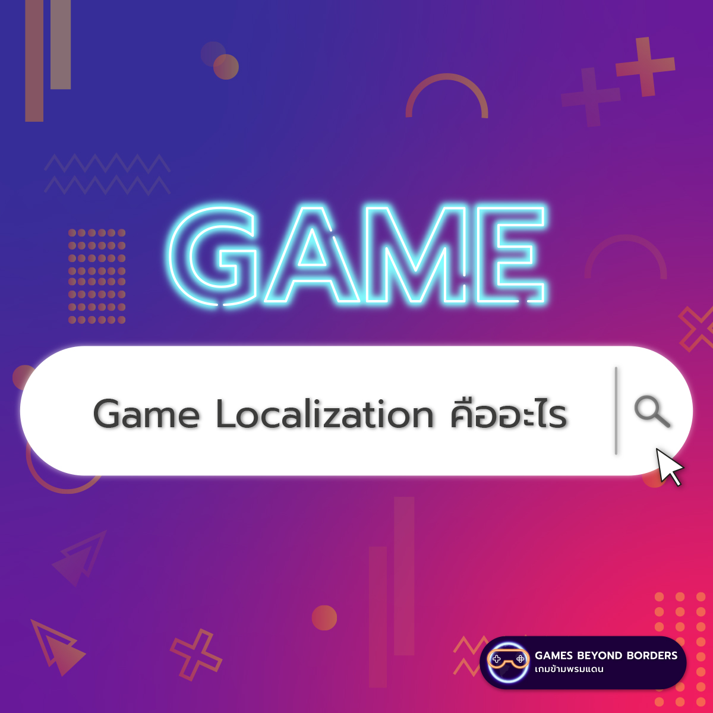
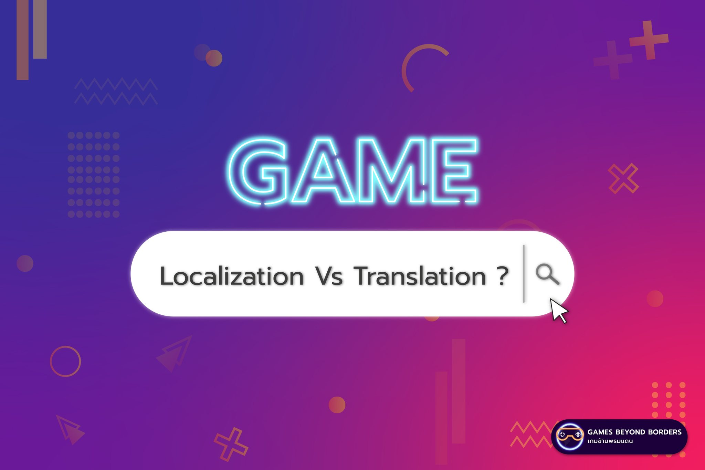

Game Localization? Game Translation? สองคำนี้เหมือน/แตกต่างกันอย่างไร

คำว่า Game localization ในบริบทของการแปลเกม มีความหมายเท่ากับ Game translation หรือไม่ คำทั้งสองคำนี้มักถูกใช้แทนกันในบางแห่งและบางบริบท แต่ถ้ามองลึก ๆ ลงไปแล้วทั้งสองคำมีความแตกต่างกันอยู่ และมีมิติที่ทับซ้อนกันอยู่อีกส่วนหนึ่ง มาดูจากมุมมองการแปลศึกษา (Translation Studies) กันค่ะ ว่าแท้ที่จริงแล้ว Game localization และ Game translation จริง ๆ แล้วเหมือนกัน ต่างกัน หรือใช้แทนกันได้หรือเปล่า

บทความขนาดสั้นชิ้นนี้เป็นผลผลิตจากโครงการ “เกมข้ามพรมแดน: การแปล เครือข่ายและอุตสาหกรรมเกมในประเทศไทย” ได้รับทุนอุดหนุนการวิจัยจากสำนักงานปลัดกระทรวงการอุดมศึกษา วิทยาศาสตร์ วิจัยและนวัตกรรม (ทุนพัฒนาศักยภาพในการทำงานวิจัยของอาจารย์รุ่นใหม่ ปีงบประมาณ 2564)

บรรณานุกรม
Bernal-Merino, M. Á. (2014). Translation and localisation in video games: making entertainment software global. Routledge.
Mangiron, C. (2018). Game on! Burning issues in game localisation. Journal of Audiovisual Translation, 1(1), 122-138.
Mangiron, C., & O’Hagan, M. (2006). Game localisation: unleashing imagination with ‘restricted’translation. The Journal of Specialised Translation, 6(1), 10-21.
O’hagan, M., & Mangiron, C. (2013). Game localization. Amsterdam and Philadelphia: John Benjamins Publishing Company.

คำว่า Localization (ตัวอักษรย่อ L10n – L และ n เป็นตัวอักษรตัวแรกและตัวสุดท้ายของคำ และเลข 10 คือจำนวนตัวอักษรที่อยู่ระหว่างกลางระหว่าง L และ n) ใช้ในหลายวงการ ทั้งวงการธุรกิจ วงการซอฟท์แวร์ วงการเกม และวงการการแปล

คำว่า Localization มีความหมายว่า การแปลเพื่อปลายทาง, การแปลเพื่อท้องถิ่น แต่หากมองจากเชิงคอมพิวเตอร์ Localization หมายความว่า “เทศวิวัฒน์” คือ การปรับให้เข้ากับท้องถิ่น ดังนั้น โดยภาพรวม คำนี้หมายถึงการปรับเปลี่ยนผลิตภัณฑ์ซอฟท์แวร์เพื่อการเผยแพร่ไปยังพื้นที่หรือตลาดที่ยังไม่เคยมีผลิตภัณฑ์ซอฟท์แวร์นั้น ๆ มาก่อน โดยเป็นการปรับเปลี่ยนเข้ามีความเหมาะสมกับพื้นที่ปลายทาง ทั้งในแง่ของภาษา รูปแบบเชิงเทคนิค วัฒนธรรม และข้อปฏิบัติและข้อจำกัดอื่น ๆ ทางกฎหมายที่เกี่ยวข้อง

จากมุมมองด้านการแปลศึกษา (Translation Studies) คำว่า Localization ถูกใช้ในทั้งสองความหมาย คือ
(1) กระบวนทั้งกระบวนการในการปรับผลิตภัณฑ์จากพื้นที่แห่งหนึ่งเพื่อกระจายไปสู่พื้นที่อีกแห่งซึ่งมีความแตกต่างด้านภาษา วัฒนธรรม และข้อจำกัดด้านกฎหมาย และ “การแปล” เป็นหนึ่งในกระบวนการเหล่านี้ (พูดง่าย ๆ ก็คือ คำนี้เป็นคำที่ใหญ่และครอบกระบวนการแปลเอาไว้)
(2) การแปลและปรับภาษาในผลิตภัณฑ์หนึ่ง ๆ ให้เข้ากับบริบทภาษาและวัฒนธรรมปลายทาง

ในบริบทของ Game localization ก็มีได้สองความหมายเช่นกัน คือ
(1) การปรับเปลี่ยนองค์ประกอบที่อยู่ภายในเกมที่มากไปกว่า ภาษา ตัวอักษร และบทพูดในตัวเกม เช่น รูปแบบของตัวละคร องค์ประกอบของภาพ และฉาก ฯลฯ ให้เหมาะสมกับบริบททางวัฒนธรรมปลายทาง และ “การแปล” เป็นหนึ่งในกระบวนการเหล่านี้ (พูดง่าย ๆ ก็คือ คำนี้เป็นคำที่ใหญ่และครอบกระบวนการแปลเอาไว้)
(2) การแปลและปรับภาษาที่ปรากฏภายในองค์ประกอบของตัวเกมให้มีความเหมาะสม และเข้ากับบริบททางวัฒนธรรมปลายทาง

คำว่า Translation แปลว่า การแปล คือ การถ่ายทอดความหมายจากภาษาหนึ่งเป็นอีกภาษาหนึ่ง คำว่าการแปล สามารถใช้กับการถ่ายทอดความหมายระหว่างภาษาต้นทางเป็นภาษาปลายทางได้ในสื่อแทบทุกประเภท รวมถึง “เกม” แม้คำว่า Translation จะไม่เป็นที่นิยมในอุตสาหกรรมเกมและการแปลเกมก็ตาม

ในวงการการแปลศึกษา (Translation Studies) เมื่อพูดถึงการแปลเกม จะปรากฏการใช้ทั้งคำว่า Game localization และ Game translation เนื่องจากนักวิชาการด้านการแปลและคนในวงอุตสาหกรรมบางส่วนเห็นว่ากระบวนการแปล (Translation) เป็นองค์ประกอบหนึ่งในขั้นตอนการ Localization เท่านั้น ด้วยเหตุนี้ ในบางบริบท จึงมีการใช้คำว่า Game translation เพื่อบ่งบอกถึงกระบวนการถ่ายทอดทางภาษาโดยเฉพาะ และเพื่อแยกให้ขาดจากกระบวนการ Localization อื่น ๆ ที่เกิดขึ้นกับเกม

Mangiron และ O’Hagan (2006) นักวิชาการด้านการแปลศึกษา จึงได้เสนอคำใหม่ขึ้นเพื่อใช้ในบริบทการแปลเกม คือคำว่า “Transcreation” (เป็นการผสมคำระหว่างคำว่า trans- ที่แปลว่า ข้าม และ creation ที่แปลว่าการสร้าง) แปลได้อย่างหลวม ๆ ว่า การแปลแบบสรรค์สร้าง คำนี้บ่งบอกถึงวิธีการแปลของนักแปลเกมที่สามารถจะปรับเปลี่ยน ละเว้น หรือเพิ่มเติมข้อความใดๆ ที่นักแปลคิดว่าจำเป็นเพื่อทำให้เกมเข้าใกล้กับผู้เล่น และเพื่อถ่ายทอดอารมณ์ความรู้สึกของตัวเกมต้นฉบับไปยังผู้เล่น

อันที่จริงแล้ว ในบริบทของการแปลเกม การแปลเพื่อให้เหมาะสมและเข้ากับบริบทปลายทาง ก็ใช้คำว่า (language/linguistic) Localization ได้เช่นกัน และในวงการการแปลศึกษา ยังมีคำอีกคำหนึ่ง คือคำว่า Domestication คือการแปลให้กลมกลืนกับบริบทของวัฒนธรรมปลายทาง

คำว่า Localization ใช้กันในหลายวงการ และในบางบริบทมีความหมายที่กว้างกว่ากระบวนการแปล ดังนั้น จากมุมมองของการแปลศึกษา สรุปหลวม ๆ ได้ว่า Game localization ในบางบริบท จะมีความหมายไม่เท่ากับ Game translation เนื่องจากการ localization มีกระบวนการที่มากกว่าการแปล นักวิชาการด้านการแปลบางส่วนจึงเสนอว่าควรจะใช้คำว่า Game language/linguistic localization เพื่อระบุเจาะจงว่าเป็นการแปลเพื่อปลายทางที่เกิดขึ้นในเกม

อย่างไรก็ดี ในปัจจุบัน หากพูดถึงคำว่าการแปลเกม แน่นอนว่าคำว่า Game localization จะเป็นที่นึกถึงก่อนคำว่า Game translation เนื่องจากเป็นที่ใช้กันอย่างแพร่หลายในอุตสาหกรรมเกม และการแปลเกม นักวิชาการด้านการแปลเองก็ใช้กัน ดังนั้น ในบริบทของการแปลเกม การใช้คำว่า Game localization และ Game translation ก็ใช้แทนกันได้ค่ะ

บรรณานุกรม
Bernal-Merino, M. Á. (2014). Translation and localisation in video games: making entertainment software global. Routledge.
Mangiron, C. (2018). Game on! Burning issues in game localisation. Journal of Audiovisual Translation, 1(1), 122-138.
Mangiron, C., & O’Hagan, M. (2006). Game localisation: unleashing imagination with ‘restricted’translation. The Journal of Specialised Translation, 6(1), 10-21.
O’hagan, M., & Mangiron, C. (2013). Game localization. Amsterdam and Philadelphia: John Benjamins Publishing Company.
